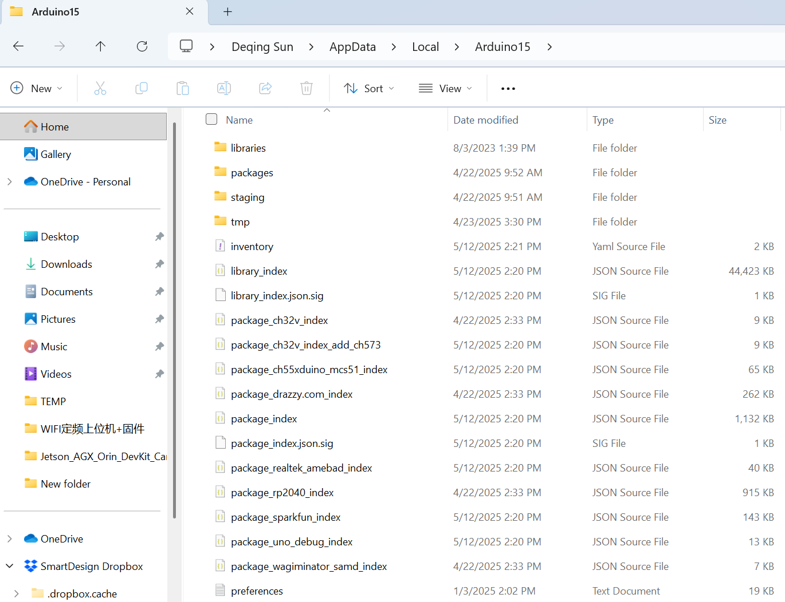
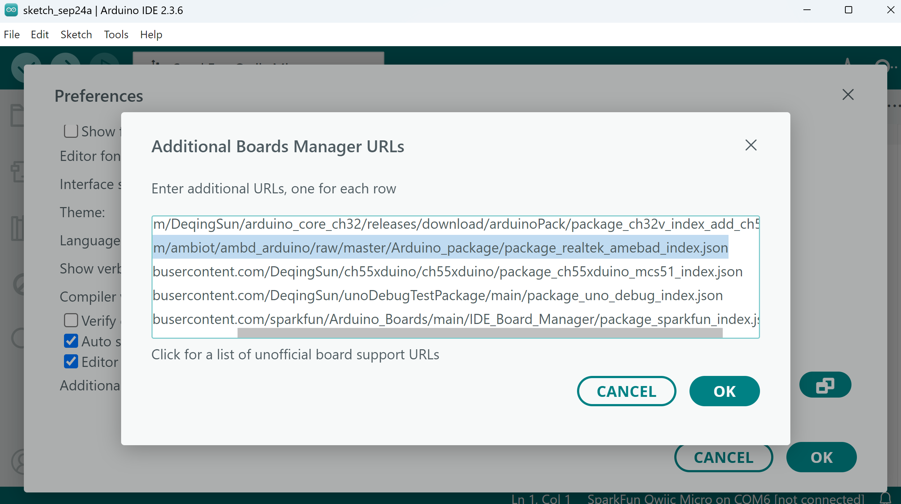
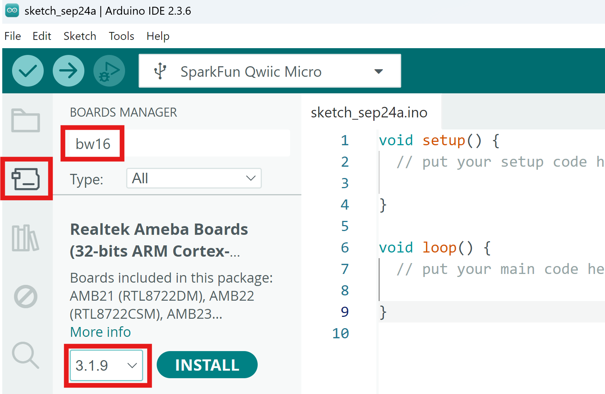
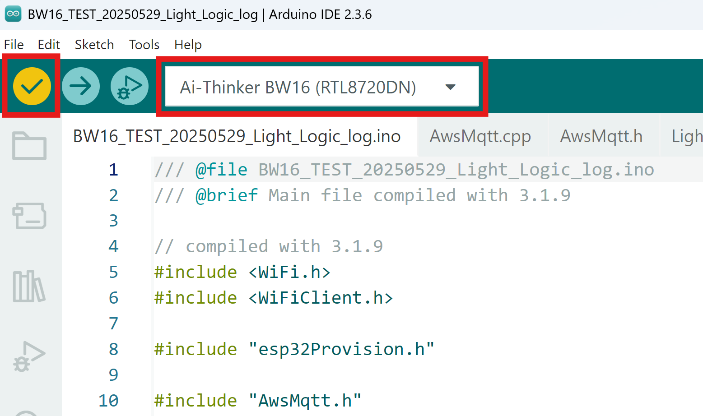
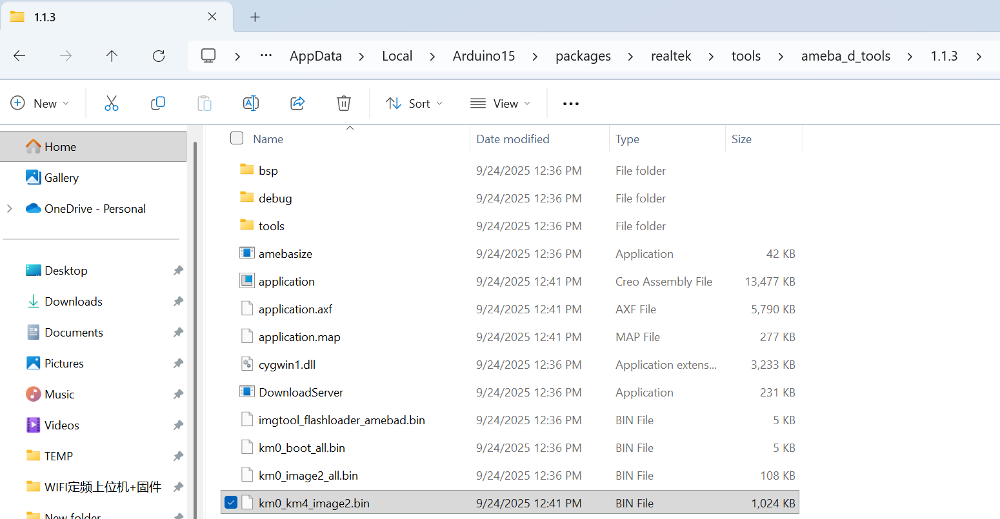
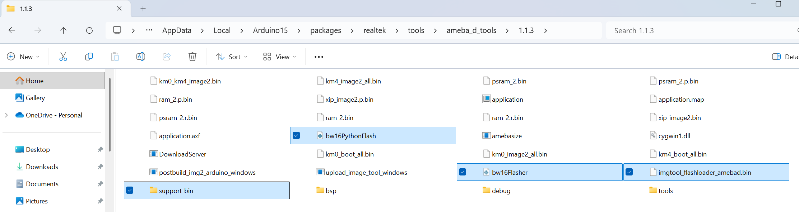
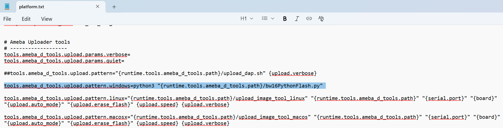
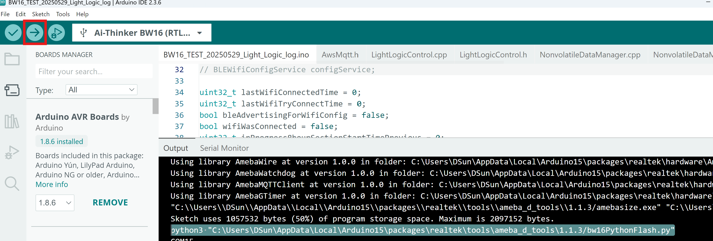

# Setup tool chain to compile binary

## Clean up old toolchain (if you have)

Make sure you quit any Arduino IDE you still opened.

Board platforms installed with the Board Manager are stored inside the Arduino15 folder. On Windows, that is `C:\Users\{username}\AppData\Local\Arduino15`

You may navigate to `C:\Users\{username}\AppData\Local\Arduino15` in Windows Explorer by typing `%USERPROFILE%\AppData\Local\Arduino15` in address bar.



`package_realtek_amebad_index.json` stores the info for dependency of BW16 support files.

`staging` stores cached package files

`packages` store toolchain of different boards. The BW16 one is in `packages\realtek`.

Delete following files/folders to completely remove the toolchain.

`package_realtek_amebad_index.json`, `staging`, `packages\realtek`

## Add toolchain again

Open Arduino IDE 2, make sure you have `https://github.com/ambiot/ambd_arduino/raw/master/Arduino_package/package_realtek_amebad_index.json` in `File > Preferences` then `Additional boards manager URLs`



In Board manager, search for BW16, make sure you choose 3.1.9 as this is the version we tested.



The 3.1.9 is required as described in the very beginning comment of `BW16_TEST_20250529_Light_Logic_log.ino`. The [3.1.9 update](https://github.com/Ameba-AIoT/ameba-arduino-d/releases/tag/V3.1.9) updated some low level binary and increase stablity significantly.

## Compile binary

Open `BW16_TEST_20250529_Light_Logic_log` in Arduino. Choose `Tools`->`Board`->`Realtek Ameba Boards (32-bits ARM Cortex-M33 @200MHz)`->`Ai-Thinker BW16 (RTL8720DN)`. 

Compile code by click check mark.



You should get a `km0_km4_image2.bin` in `C:\Users\{username}\AppData\Local\Arduino15\packages\realtek\tools\ameba_d_tools\1.1.3`



## Flash firmware to board

Copy the `km0_km4_image2.bin` next to `bw16PythonFlash.py` to flash it. Or you pull the new python code on/after 2025 Sep 24, just run command like:

`python3 .\deqingTestDevices\bw16PythonFlash.py c:\Users\DSun\AppData\Local\Arduino15\packages\realtek\tools\ameba_d_tools\1.1.3\km0_km4_image2.bin`

## Add bw16PythonFlash.py into Arduino package for faster upload (optional)

This step is only necessary if you want to use Arduino Upload funtion to flash code with the python script. It is faster and automatically erase the necessary sections, and it will use correct bootloader.

Copy `support_bin`, `bw16Flasher.py`, `bw16PythonFlash.py`, `imgtool_flashloader_amebad.bin` to `C:\Users\{username}\AppData\Local\Arduino15\packages\realtek\tools\ameba_d_tools\1.1.3`



Open `C:\Users\{username}\AppData\Local\Arduino15\packages\realtek\hardware\AmebaD\3.1.9\platform.txt`

Replace

```
tools.ameba_d_tools.upload.pattern.windows="{runtime.tools.ameba_d_tools.path}/upload_image_tool_windows.exe" "{runtime.tools.ameba_d_tools.path}" "{serial.port}" "{board}" "{upload.auto_mode}" "{upload.erase_flash}" {upload.speed} {upload.verbose}
```

to 

```
tools.ameba_d_tools.upload.pattern.windows=python3 "{runtime.tools.ameba_d_tools.path}/bw16PythonFlash.py"
``` 



Restart Arduino IDE.

Now the upload function will use the python script instead of the original tool.


