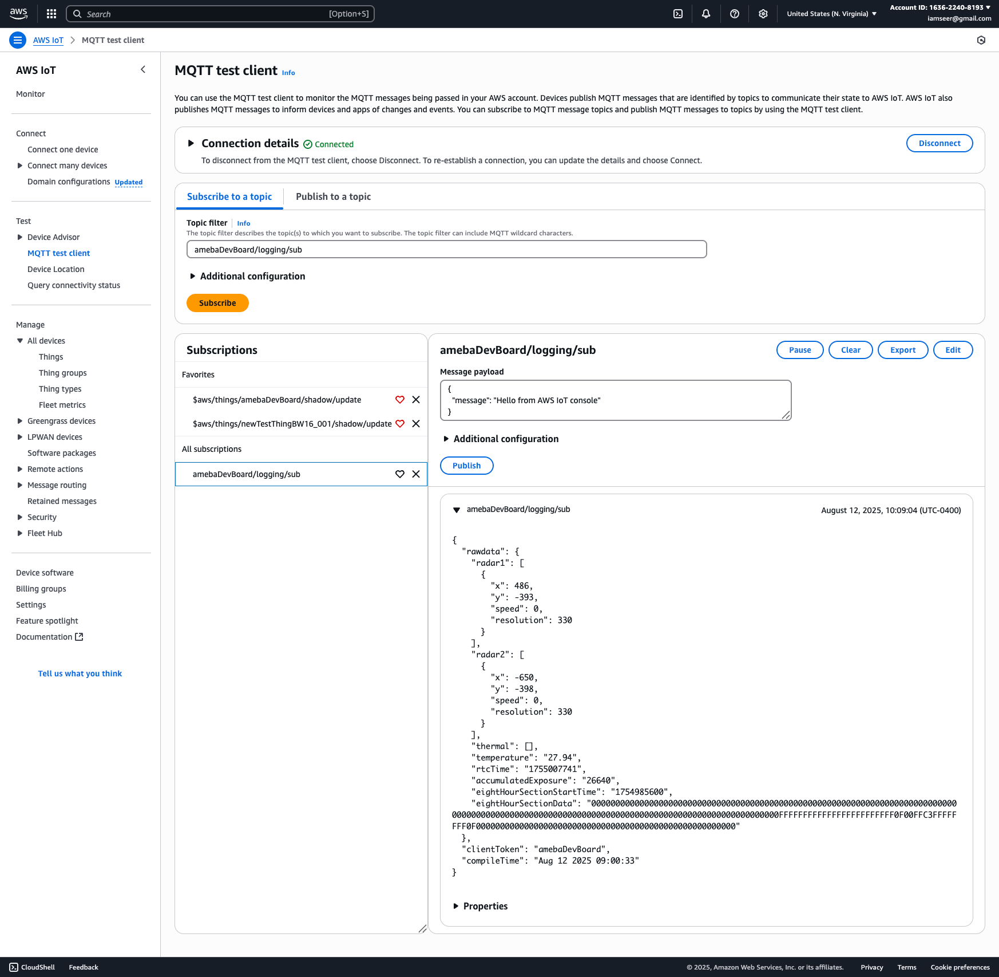
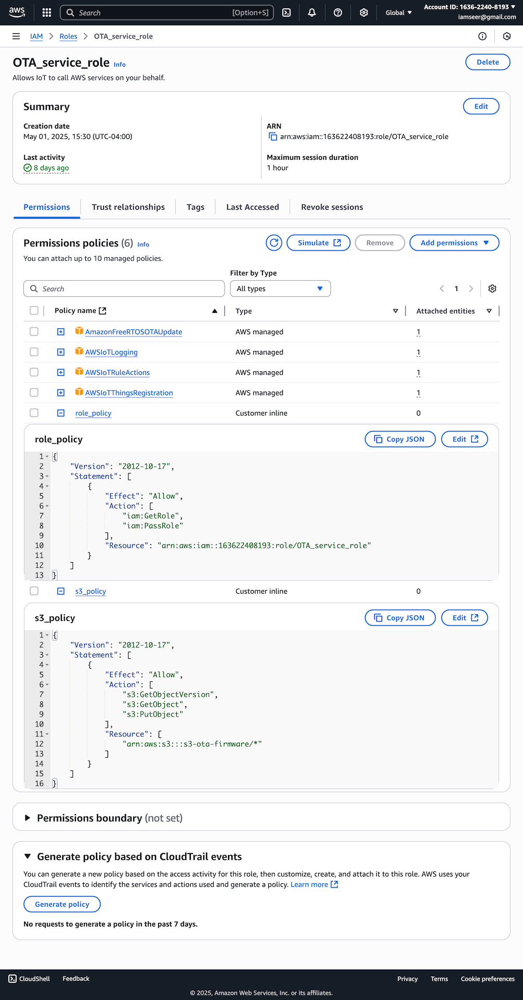
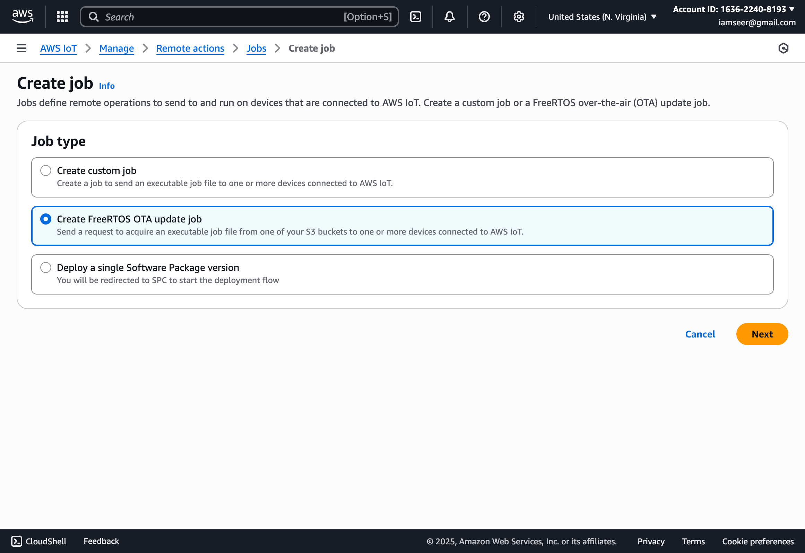
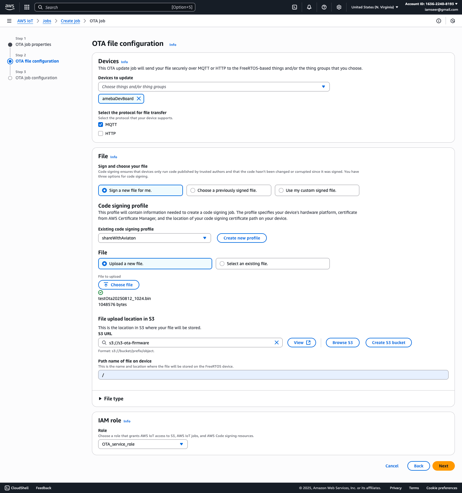
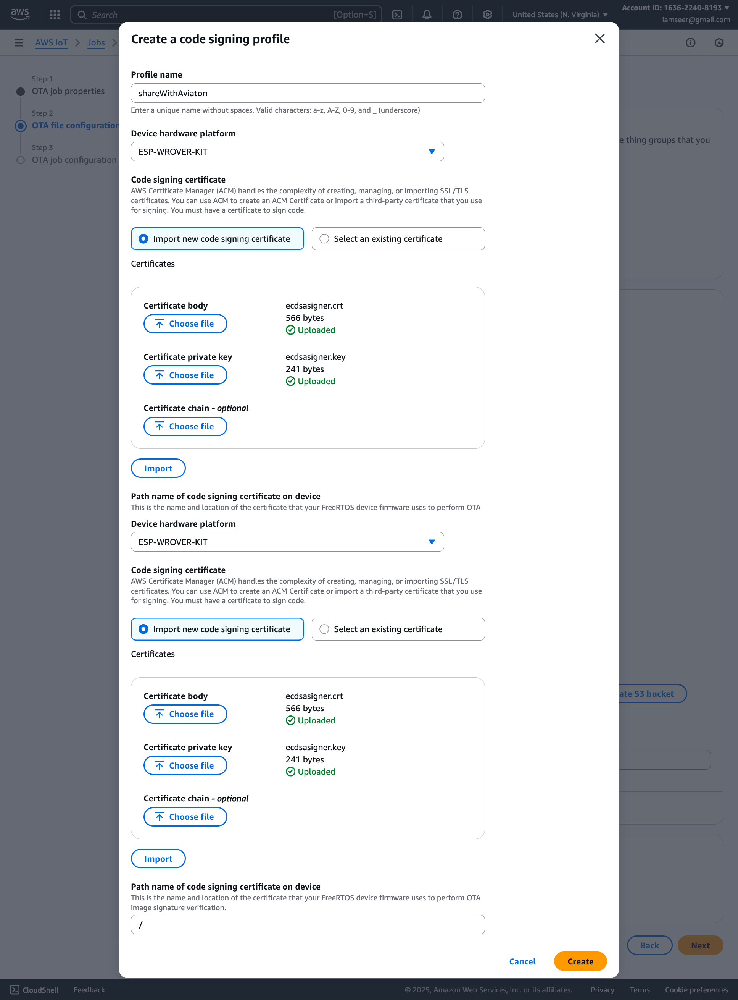

# How to test Ota on your own AWS server

### Prepare key and cerfiticate

Note AWS does not allow user to download key after thing is create. So the key must be prepared when the thing is created.

Put the ```*.cert.pem``` and ```*.private.key``` file in the ```keyPreparation``` folder. Run the ```packCredentials.py``` to generate the bin file.

For example, I have ```amebaDevBoard.cert.pem``` and ```amebaDevBoard.private.key```, I will get ```amebaDevBoard.bin```.

Use command ```python3 'SCRIPT_PATH/bw16PythonFlash.py' userdata 'BIN_PATH/amebaDevBoard.bin'``` to flash the credentials to the board, the path need to be adjusted to fit your system.

### Change aws server address

In file ```AwsMqtt.cpp```, change ```const char mqttServer[]``` around line 32, to the address of your AWS server, for me, it was ```a1e9mdr77wm319-ats.iot.us-east-1.amazonaws.com```

Compile and flash firmware, and the board should connect to your server.

### Check data with MQTT test client (optional)

On tad's server, the logging goes to ```String debugTopic = String(thingName) + "/logging/sub";``` in ```void AwsMqtt::debugLog(char* payload)```.

We can check the data logging with Aws Iot Console's MQTT test client. Subscribe ```YOUR_THING_NAME/logging/sub``` and you will be able to see the logging from the device.



Meanwhile, you can also use ```Publish to a topic``` feature to send data to device. You may send to ```YOUR_THING_NAME/command/sub``` data like ```{mode: "UV_MODE_MANUAL"}``` or ```{mode: "UV_MODE_OFF"}``` to change the mode.

### setup IAM role

IAM (Identity and Access Management) role. In OTA prcoess it grants the Wifi device permission to access S3 to download the update image.

The AWS tutorial is on https://docs.aws.amazon.com/freertos/latest/userguide/create-service-role.html

And the screenshot is the sample IAM role I used.



### prepare OTA firmware binary.

The "Export compiled binary" feature does not work in Arduino, find ```km0_km4_image2.bin``` in ```Arduino15/packages/realtek/tools/ameba_d_tools/1.1.3/```, copy it out and rename it.

### Push OTA update in AWS

Create FreeRTOS OTA update job



Add the binary as OTA file.



If the code signing profile is not ready, add it like this. Using the ecdsasigner crt and key file.



After about 12 minutes the OTA should be ready.

