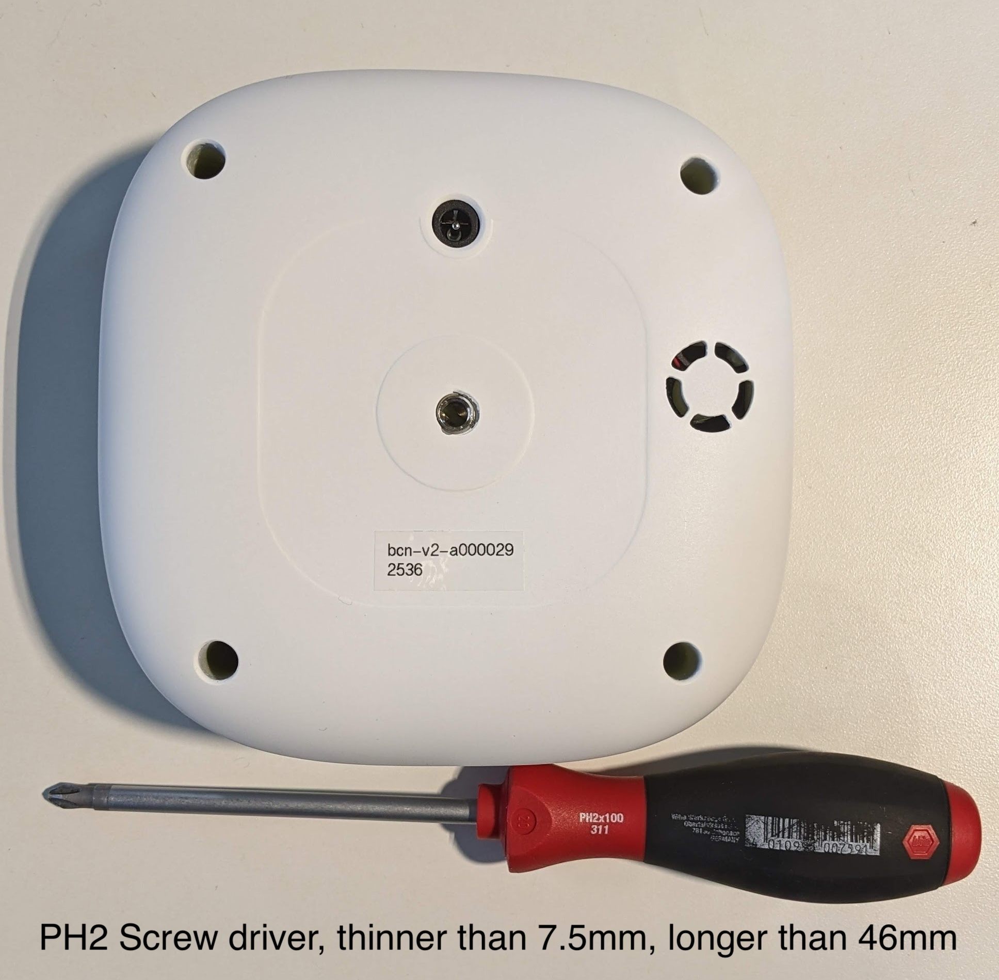
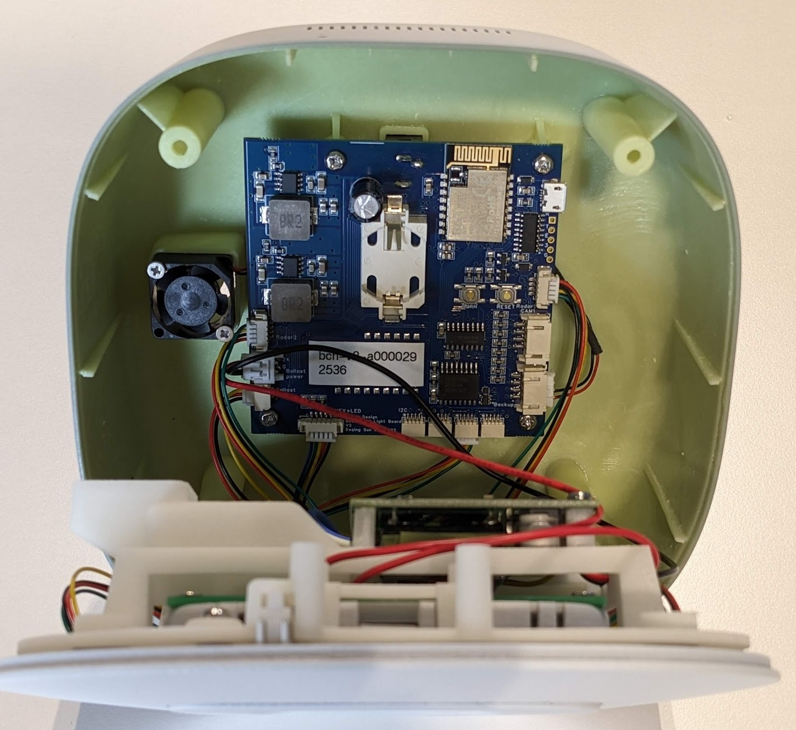
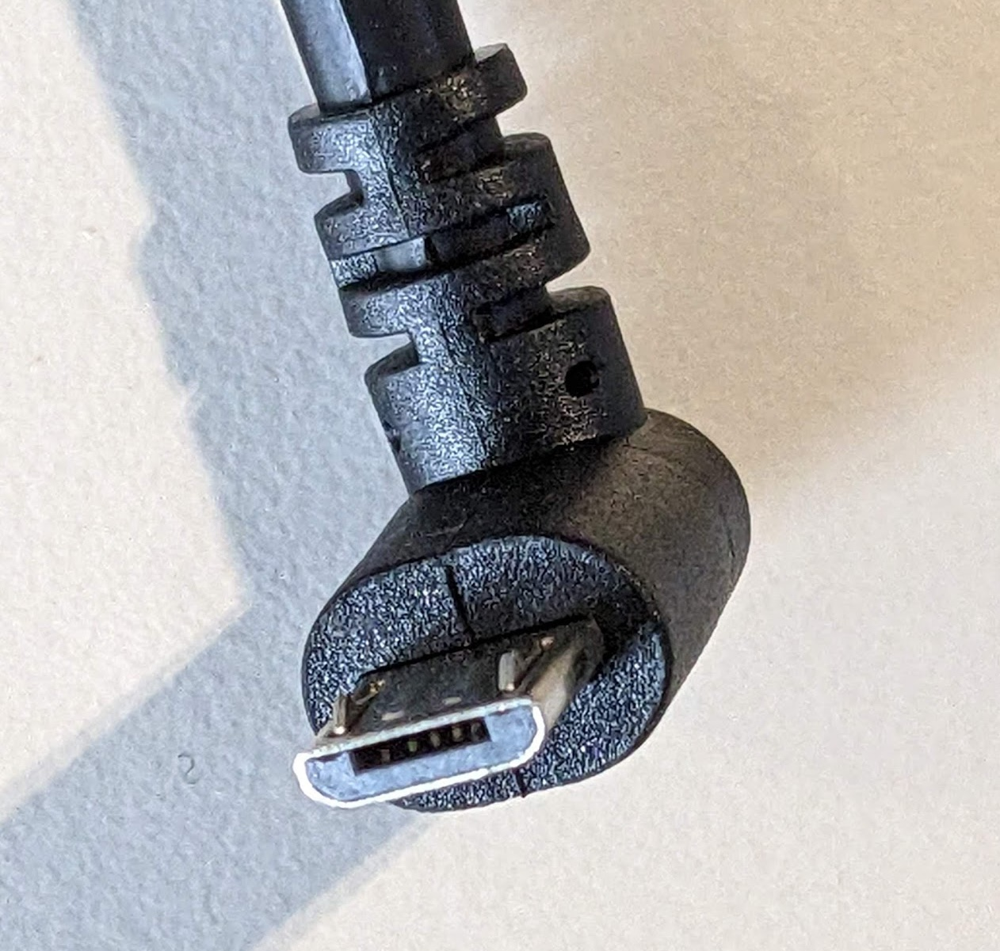
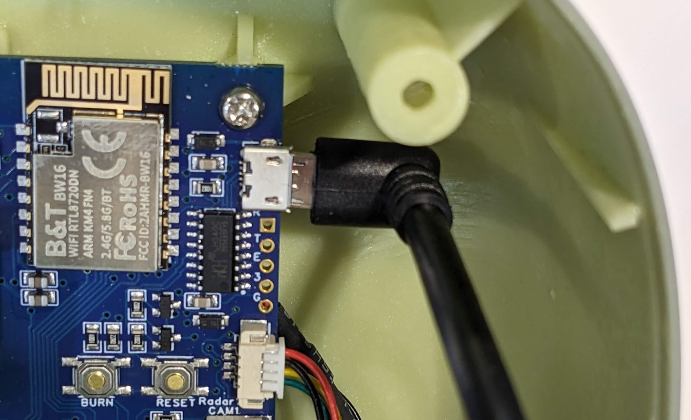
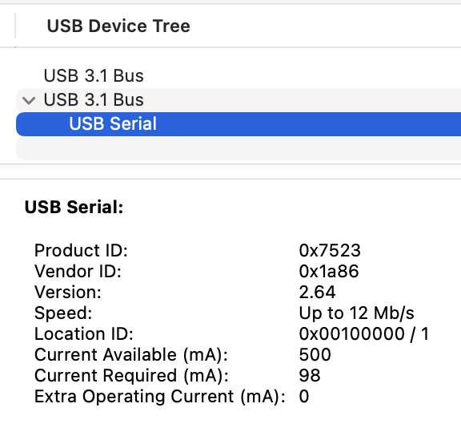
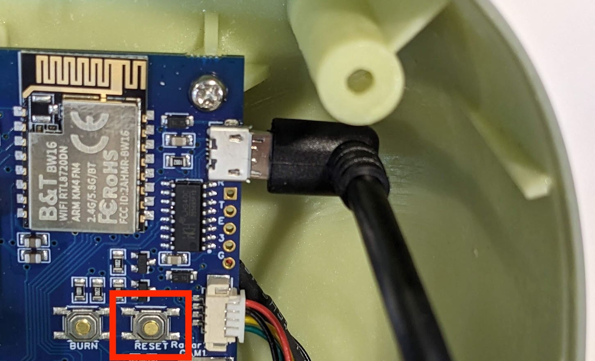
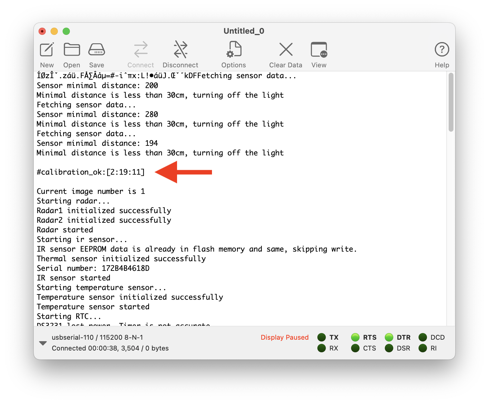
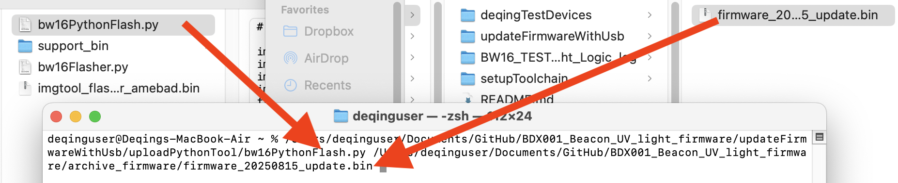
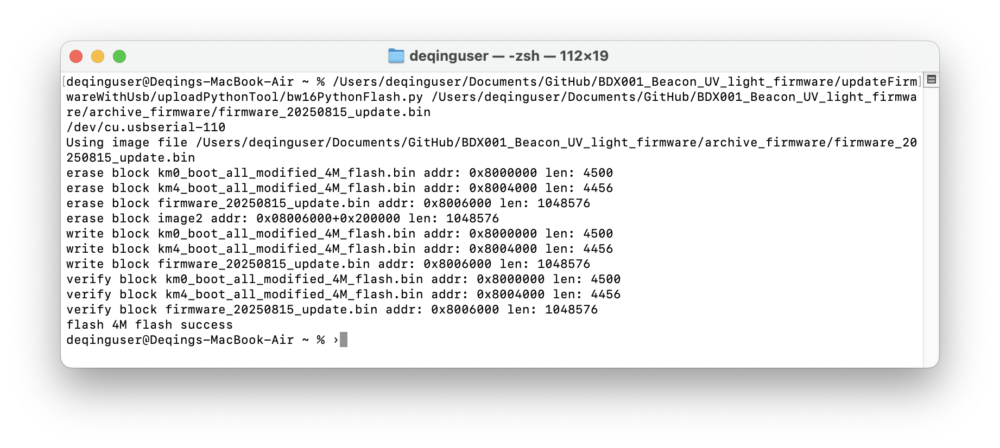
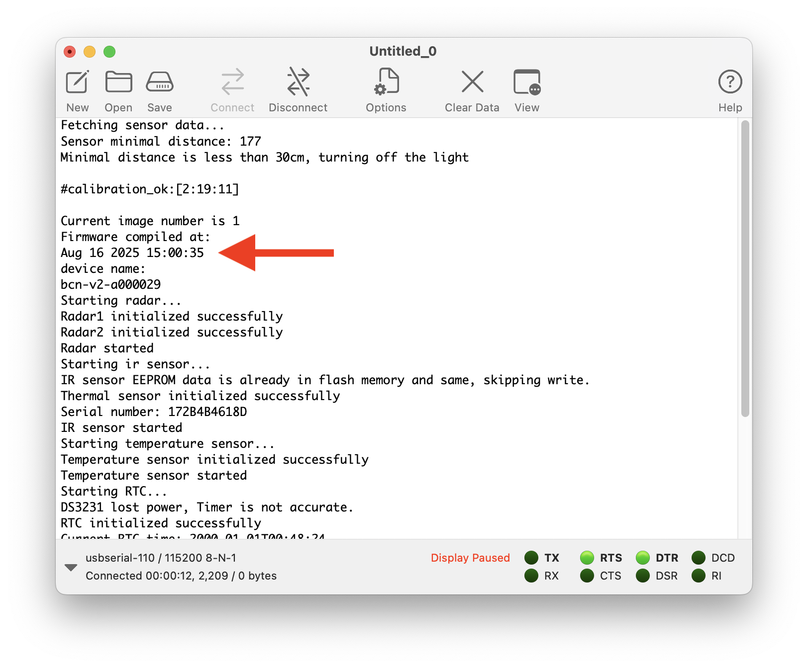

# How to open the device and update the firmware

## Open the case

Prepare a Phillips-Head screwdrivers, ideally PH2. The screw driver should be not thicker than 7.5 mm or shorter than 46mm, so the screw driver can fit the screw hole and reach the screw.

Unscrew the 4 screws in the corners. You can open the front cover. There will be wires attaching ballast and radar, you can keep them connected.

## Connect board to computer

A right angle Micro-USB cable is suggested, because such a cable avoids taking the main board off. If you only have a straight cable, you may have to take the main board off.

Plug MicroUSB to main board, the other side to computer.

A USB Serial device should appear on computer. This is the USB-serial bridge chip on the main board. It can do serial log viewing, and it can flash the firmware to the device.

## Check code version on device (optional)

Use a serial terminal application, connect to the serial port at 115200 baud rate. Open the serial port. Then press the `reset` button to reboot the device to view logs on bootup.

The `#calibration_ok:[2:19:11]` indicates the power up of the device. We did not see the compliation time shortly after, this must be a very old firmware.

Disconnect the serial port to make it available to the upload tool.

## Use Python script to update the firmware

There is a customized script to update the firmware. There is a `uploadPythonTool.zip` and it contains everything we need. You may unzip the file to get the tools.

The script relies on a Python library [pyserial](https://pypi.org/project/pyserial/) to do serial communication. If you do not have it, run the command to install it.

`pip install pyserial`

Then you can try to run the python script `bw16PythonFlash.py` with the path to the binary you want to update. One way to do this is: you drag the `bw16PythonFlash.py` into terminal, and the then you drag the firmware, you would get command like:

`/Users/deqinguser/Documents/GitHub/BDX001_Beacon_UV_light_firmware/updateFirmwareWithUsb/uploadPythonTool/bw16PythonFlash.py /Users/deqinguser/Documents/GitHub/BDX001_Beacon_UV_light_firmware/archive_firmware/firmware_20250815_update.bin`

Press enter to run it, the firmware will be flashed to the device.

## Check code version on device one more time(optional)

Use a serial terminal application, connect to the serial port at 115200 baud rate. Open the serial port. Then press the `reset` button to reboot the device to view logs on bootup.

It show the firmware is complied on Aug 16.

## Put screw back

Disconnect usb cable, put front cover back. 

Since the screws are self-tapping one, it has risk of recutting threads on screw back. You may lightly screw backward until you feel screw dropped down slightly, and then you can screw forward into the original threads.
